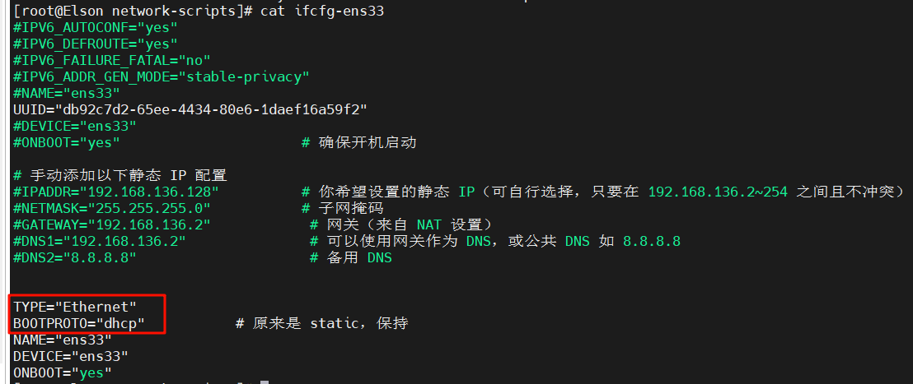
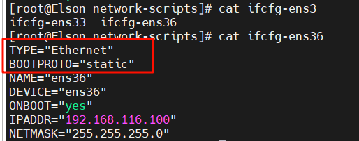
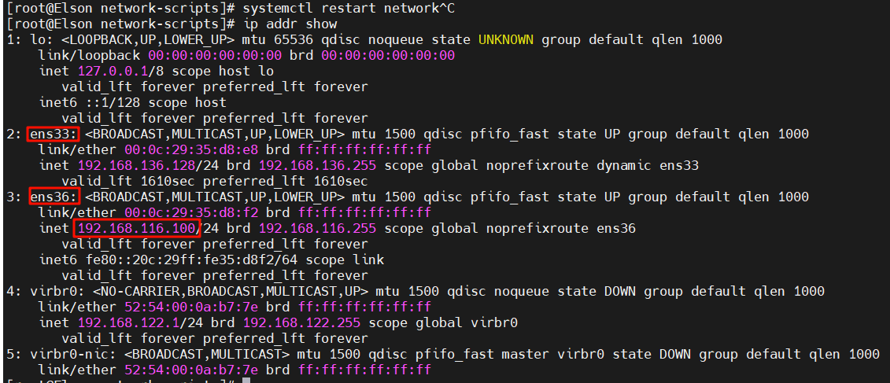
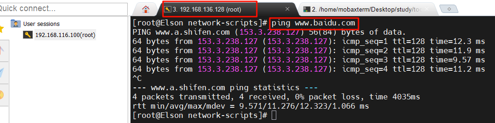

### 虚拟机创建双网卡

本宿主机没有VMnet0无法改变为桥接模式，需要VMware创建双网卡，一个NAT动态网络用于虚拟机网络连接，一个host-only用于ssh连接，后者其配置是静态网络拥有人为分配的ip。

##### 1. 修改NAT配置：

该网卡ens33配置用于能够上网。

##### 2. 修改host-only配置：

该网卡ens36用于ssh连接。

##### 3. 网络生效且配置检查：

##### 4. 结果验证：

能ssh连接能上网。

