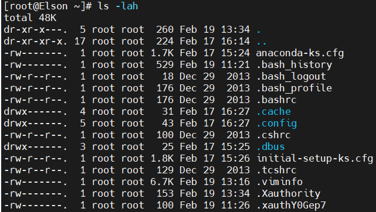
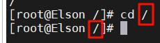
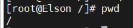
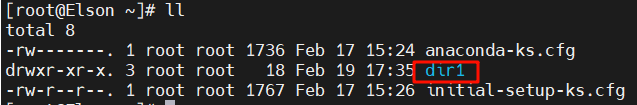
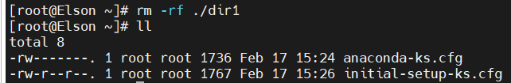
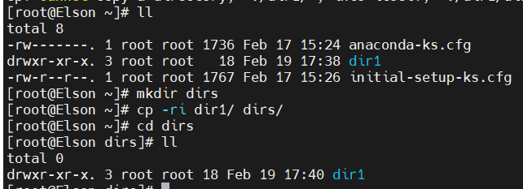
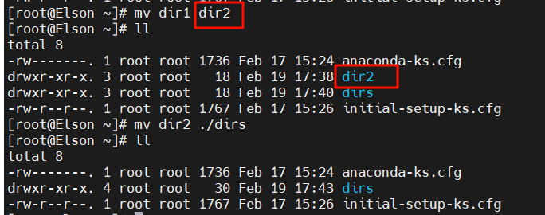
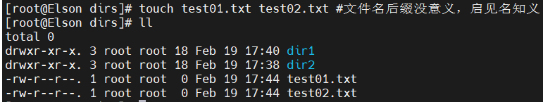
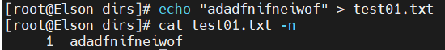

##### 1. ls 列出当前目录内容可以指定

-l 详细信息

-a 全部文件包括隐藏文件

-h 人可识别大小

##### 2. cd 切换目录

##### 3. pwd 打印当前工作目录

##### 4. mkdir 创建目录

-p 递归创建目录；只能创建目录，mkdir dir1单层目录。

##### 5. rm 删除文件或者目录

-r 递归

-f 强制且不显示删除过程信息

##### 6. cp 复制指定目录到指定目录

-r 递归

-i 覆盖前提示

##### 7. mv 移动或者重命名

##### 8. touch 创建单个或者多个空文件或者更改文件的时间戳

##### 9. cat 显示文件全部内容

-n 显示行号

##### 10. less 适合大文件查看和匹配

- /keyword 匹配关键字

  

