### Linux

#### 文件目录

##### 1. ls 列出当前目录内容可以指定

-l 详细信息；

-a 全部文件包括隐藏文件；

-h 人可识别大小。

##### 2. cd 切换目录

##### 3. pwd 打印当前工作目录

##### 4. mkdir 创建目录

-p 递归创建目录；只能创建目录，mkdir dir1单层目录。

##### 5. rm 删除文件或者目录

-r 递归；

-f 强制且不显示删除过程信息。

##### 6. cp 复制指定目录到指定目录

-r 递归；

-i 覆盖前提示。

##### 7. mv 移动或者重命名

##### 8. touch 创建单个或者多个空文件或者更改文件的时间戳

##### 9. cat 显示文件全部内容

-n 显示行号。

##### 10. less 适合大文件查看和匹配

- /keyword 匹配关键字；

  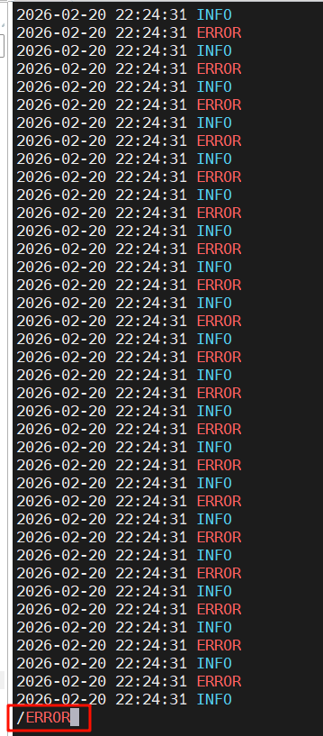

- page up 上一页； page down下一页；g首行；G尾行；q退出。

##### 11. head显示靠首行的行

-n 控制显示几行。

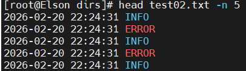

##### 12. tail显示靠行尾的行

-n 控制显示行数；

-f 实时显示（常用）；

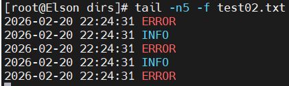

-F 跟踪滚动日志。

##### 13. whoami 查看当前用户

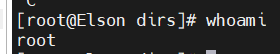

##### 14. su 切换用户

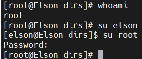

##### 15. 查看全部用户

冒号前的第一列全是用户

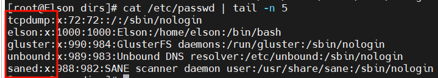

##### 16. groups 查看当前的组

groups 直接查看当前用户的组

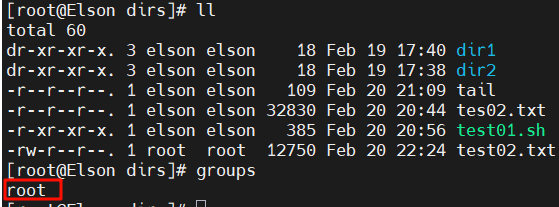

groups 用户名：查看特定用户名的组

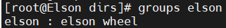

##### 17. id 查看当前目录用户更详细的信息

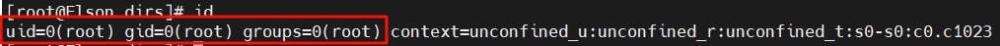

#### 权限管理

##### 1. chmod

\+ 赋予权限r w x；

\- 回收权限r w x；

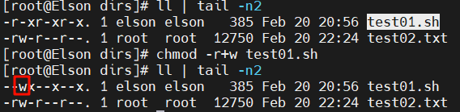

只针对当前用户

4 = r; 2 = w ; 1 = x;

-R 递归赋予或者回收权限；

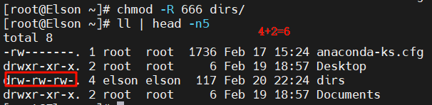

都会没有执行的权限，以前有现在不会有。

##### 2. chown 改用户或者组，可以同时

-R 递归更改。

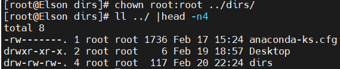

#### 进程管理

##### 1. 