### Linux

#### 文件目录

##### 1. ls 列出当前目录内容可以指定

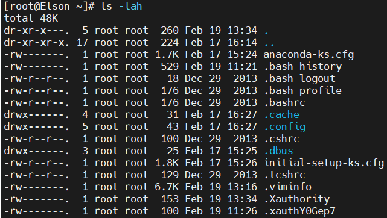

-l 详细信息；

-a 全部文件包括隐藏文件；

-h 人可识别大小。

##### 2. cd 切换目录

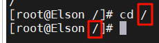

##### 3. pwd 打印当前工作目录

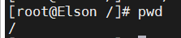

##### 4. mkdir 创建目录

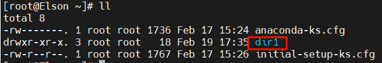

-p 递归创建目录；只能创建目录，mkdir dir1单层目录。

##### 5. rm 删除文件或者目录

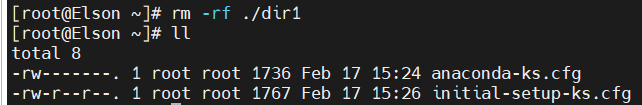

-r 递归；

-f 强制且不显示删除过程信息。

##### 6. cp 复制指定目录到指定目录

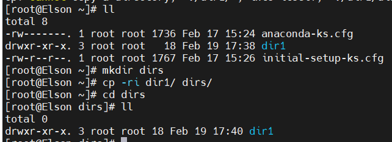

-r 递归；

-i 覆盖前提示。

##### 7. mv 移动或者重命名

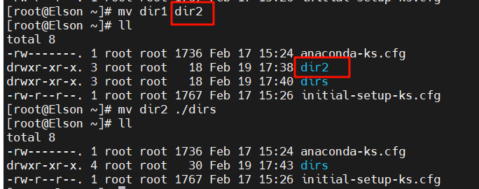

##### 8. touch 创建单个或者多个空文件或者更改文件的时间戳

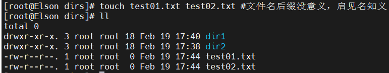

##### 9. cat 显示文件全部内容

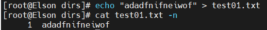

-n 显示行号。

##### 10. less 适合大文件查看和匹配

- /keyword 匹配关键字；

  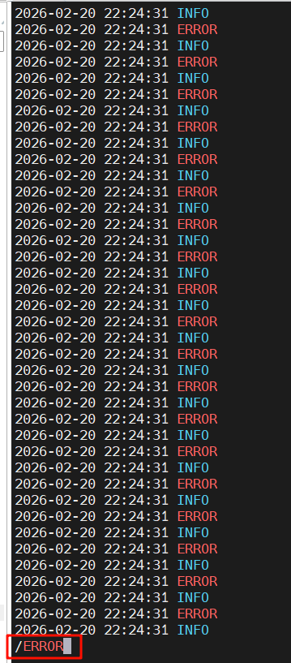


- page up 上一页； page down下一页；g首行；G尾行；q退出。

##### 11. head显示靠首行的行

-n 控制显示几行。

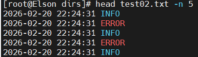


##### 12. tail显示靠行尾的行

-n 控制显示行数；

-f 实时显示（常用）；

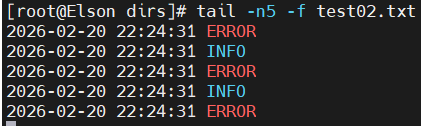


-F 跟踪滚动日志。

##### 13. whoami 查看当前用户

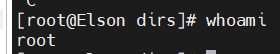

##### 14. su 切换用户

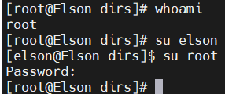


##### 15. 查看全部用户

冒号前的第一列全是用户

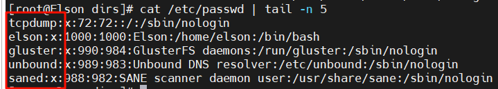

##### 16. groups 查看当前的组

groups 直接查看当前用户的组

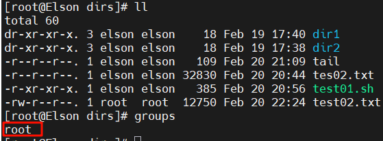

groups 用户名：查看特定用户名的组

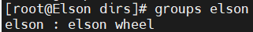

##### 17. id 查看当前目录用户更详细的信息

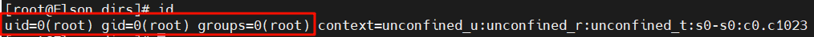


#### 权限管理

##### 1. chmod

\+ 赋予权限r w x；

\- 回收权限r w x；

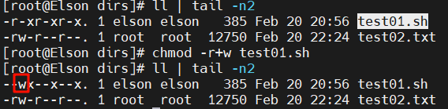

只针对当前用户

4 = r; 2 = w ; 1 = x;

-R 递归赋予或者回收权限；

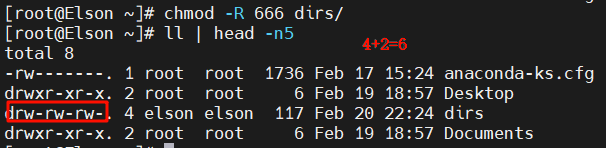


都会没有执行的权限，以前有现在不会有。

##### 2. chown 改用户或者组，可以同时

-R 递归更改。

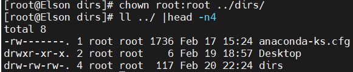


#### 进程管理

##### 1. ps 进程快照

-aux：可以不带-，一样的效果；a，tty下的全部进程；u，以面向用户的格式；x，显示没有控制终端的进程（守护进程或者后台进程）

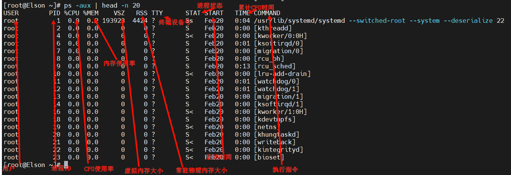

该组合参数常用于查看进程状态，资源使用状况，排查性能问题。

-ef：e，显示所有进程（似-A）；f，完整格式显示

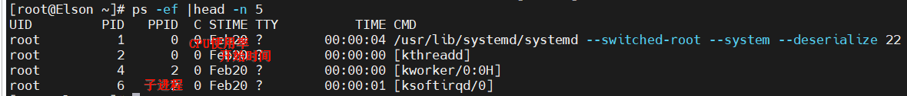

该组合参数常用于查看父子进程。

--sort=-列名：-，代表降序；列名，忽略大小写。

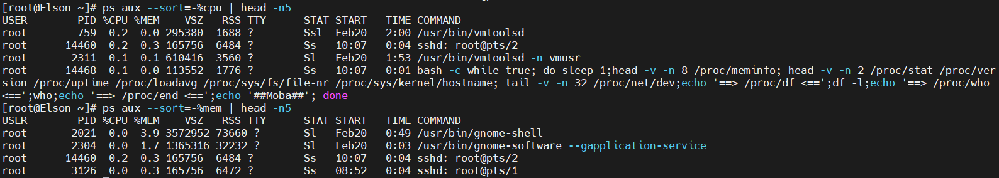

##### 2. top 动态查看进程资源

按键p按照cpu降序，c显示完整指令，m按照内存降序，t按执行照时间降序

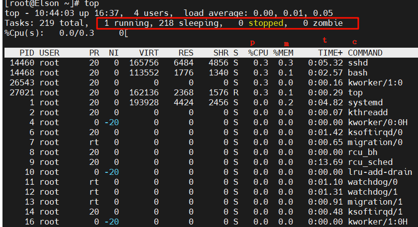

##### 3. kill 杀死进程

-9 强制杀死；-15 温和杀死，不一定杀死；

kill -9 pid


#### 网络命令

##### 1. ping 测试网络连通性

-c 指定发送次数（发几个包）

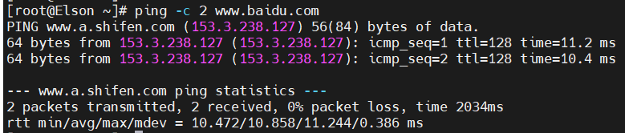

##### 2.  ifconfig 查看配置网络结构（ip addr [show]）

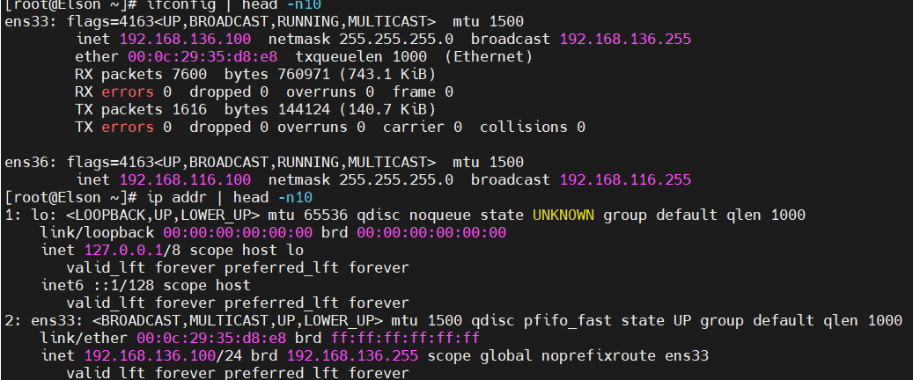

##### 3. netstat(network statistics) 

netstat 显示网络连接、路由表和接口统计等信息。

-t 显示tcp；-u 显示UDP；-l 显示正在监听；-n 数字形式显示 ip 和 port

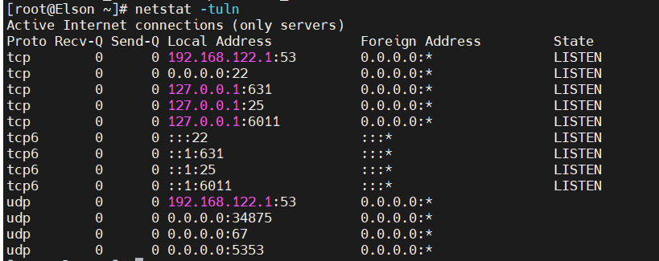

-c 实时刷新；-p显示进程；-a显示全部进程

##### 4. curl 发送http请求

-o 指定请求返回输出路径；-X 指定请求方式；

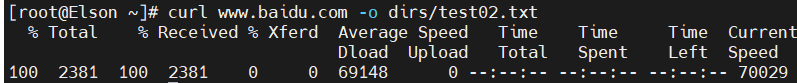


#### 压缩打包

##### 1. tar 打包解包

-z .tar.gz类型；-c 创建；-v 显示过程；-f 指定要打包成的文件名；-x 解压

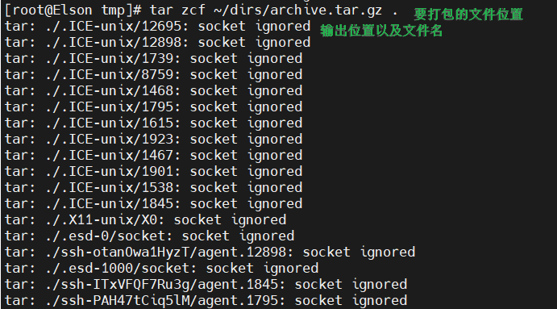

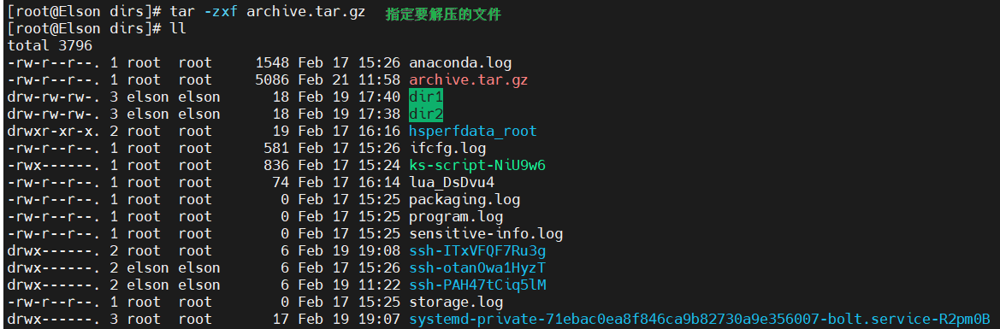

##### 2. gzip 压缩解压.gz文件

-d 解压，仅适用于单个大文件。

gzip file.txt 或者 file.tar 

gzip -d file.txt.gz 或者 file.tar.gz


#### 文本处理（重中之重）

##### 1. grep 搜索文本

-i 忽略关键字大小写；-n 显示搜索出来的关键字所在行；-w 精确单词匹配；-v 显示非关键字的所在行的内容；

-r 递归搜索目录；-c 统计匹配的行数；-l 批量查找那些文件包含此关键字；-L 批量查找那些文件不含此关键字；

-m (max) 控制匹配次数；--color 高亮显示关键字；

-A (after) 显示关键字的后几行；-B (before) 显示关键字的前几行；-C (content) 显示关键字的前后各几行；

-P 扩展使用正则表达式；-o (only-matching) 只输出匹配的部分，而不是整行

- ###### task01

统计日志中总共有多少个 `TEST_PASSED` 和 `TEST_FAILED`（不区分大小写）

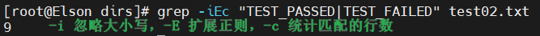

- task02

找出所有包含 `ERROR` 的行，并显示行号

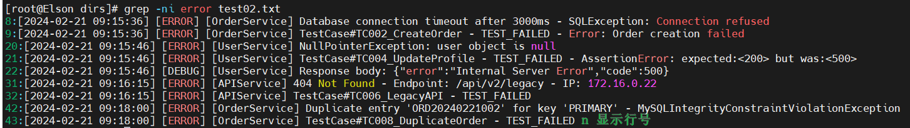

- ###### task03

反向匹配：找出所有**不包含** `INFO` 的行（只看错误、警告和调试信息）

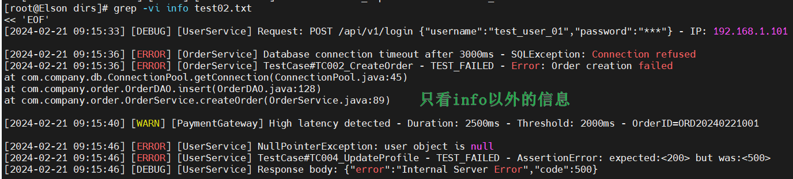

- ###### task04

递归搜索：假设 logs 目录下有多个子目录，搜索所有文件中包含 `NullPointerException` 的文件（只显示文件名，不显示内容）

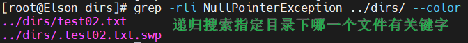

- ###### task05

查找 `SQLException` 相关的错误，并显示**后 3 行**（看完整堆栈）

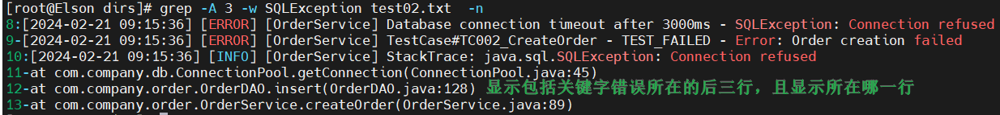

- ###### task06

查找所有 `TEST_FAILED` 的行，并显示**前 1 行**（看是什么测试用例失败了）

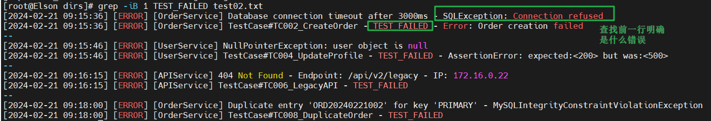

- ###### task07

使用 `-o` 参数提取所有 `OrderID=xxx` 的值（只要 OrderID 后面的编号，如 ORD20240221001）

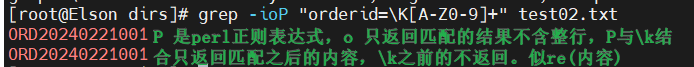

- ###### task08

提取所有 IP 地址（使用正则，提示：数字.数字.数字.数字 格式）

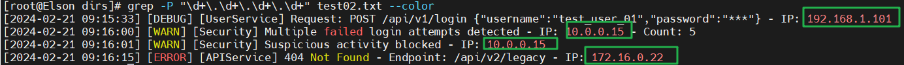

-P 更像re的功能

- ###### task09

精确匹配单词：查找 `error` 但不要匹配到 `SQLException` 或 `TEST_FAILED` 中的 error 部分（用 `-w`）

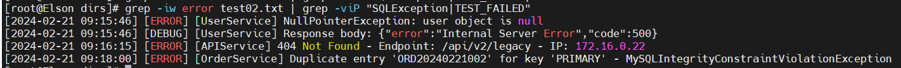

- ###### task10

统计每种日志级别（ERROR/WARN/INFO）各出现多少次（结合 `sort | uniq -c`）

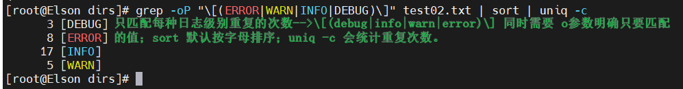

单独的uniq是去重；wc -l file.txt 统计行数。

- ###### task11

找出所有响应时间超过 1000ms 的接口（提示：查找 `Duration:` 后面大于 1000 的数字，需要正则）

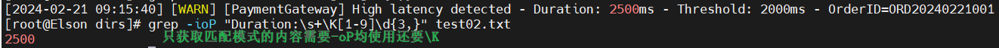

上面可以等于1000

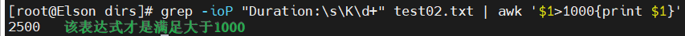

- ###### task12

统计失败率 - 计算 `Failed` 数量占 `Total` 的比例（从最后一行提取数字计算）

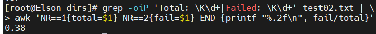

直接使用 | 书写两个完整的表达式；NR就是所有行从1开始，NR==1表示第一行；NF 列数。

- ###### task13

写一个脚本命令：如果日志中存在 `CRITICAL` 或 `FATAL`，则输出 "紧急告警"，否则输出 "系统正常"（使用 `-q` 参数）

```shell
#!/bin/bash

num=$(grep -qiP "critical|fatal" test02.txt && echo 1 || echo 0)
echo $num
if [ $num -eq 1 ]; then
        echo "紧急告警"
else
        echo "系统正常"
fi
# if grep -qiP "critical|fatal" test02.txt; then
#	pass
# fi
```

- ###### task14

批量处理：查找所有 `Duration: xxxms` 并提取数字，计算平均响应时间（结合 `awk`）

```shell
#!/bin/bash

value=$(grep -iPo "Duration:\s\K\d+" test02.txt --color)
# echo $value 125 2500
echo $value | awk '{sum=0;for(i=1;i<=NF;i++) sum+=$i} END{print sum/NF}'
# NF 列数；$NF 最后一个值；$NF-1倒数第二个值。
```

##### 2. awk 强大的文本处理工具，按列处理

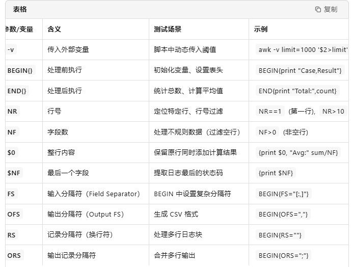

```bash
awk 'BEGIN{初始化或者设置表头：处理前}{处理中}END{处理后}'
```

- ###### -v 传入外部变量

-v 定义的变量在awk处理之前就已经赋值，可以解决“脚本外部动态配置阈值”，可以在BEGIN或任何规则中使用。

```bash
#!/bin/bash

limit=500
# awk -F '|' -v limit1=$limit '{print $3}' test_execution.log | grep -Poi "duration=\K\d+" | awk '$1>limit1{print $0}'
awk -F '|' '{print $3}' test_execution.log | grep -Poi "duration=\K\d+" | awk -v limit1=$limit '$1>limit1{print $0}'
# -v 传递外部变量需要定义一个变量赋予值才行: -v inner_var=$external_var
# 明确是哪一个awk使用，则-v在那一部分
# 多个变量，则多个-v

```

- ###### $0 整行

```bash
[root@Elson dirs]# awk -F '|' '{print $3}' test_execution.log | grep -Poi "duration=\K\d+" | awk '$1>500'
3005
5002
890
[root@Elson dirs]# awk -F '|' '{print $3}' test_execution.log | grep -Poi "duration=\K\d+" | awk '$1>500{print $0}'
3005
5002
890
[root@Elson dirs]# cat test_execution.log | head -n1
=== Test Suite Started at 2024-02-22 09:00:00 ===
[root@Elson dirs]# cat test_execution.log | head -n2
=== Test Suite Started at 2024-02-22 09:00:00 ===
[TestCase] TC001_UserLogin | Status=PASSED | Duration=125ms | ThreadID=5 | IP=192.168.1.101
```

- ###### awk 'BEGIN{1次} {逐行遍历，主要核心代码} END{1次}'

```bash
#!/bin/bash
awk -F ',' '
BEGIN{
        sum=0;
        count=0;
        max_time=0;
        print "==========性能测试报告==========";
        print "接口状态      |    耗时(ms) | 状态";
        print "--------------------------------";
}
NR>=2 {
        sum+=$2;
        count+=1;
        # print $3 " | " $2 " | " 7;
        printf "%-14s| %-10d | %-8s\n",$3,$2,$7
        # printf "%-12s| %-10d | %-8s\n",$3 $2 $7
}
$2>max_time && NR>=2{
        max_time=$2;
}
END{
        print "--------------------------------";
        print "请求总数：" count;
        print "平均耗时：" sum/count;
        print "最大耗时：" max_time;
        print "==========报告结束=========="
}

' performance_result.csv

# awk是指令，不是shell编程
# BEGIN END 必须大写，他们括号里的内容只会执行一次
# 主体块中的代码{}取决于有多少行，有多少行就会执行多少次
# awk中的变量是直接变量名，非shell脚本带$，当然也有特俗的几个$1 $? $$ NR NF
# 多个主体块{}之前可以有判断if ($1>100){主体块} 或者 简写：$1>100{}
# 一个块中，多个语句使用;分隔
# 多个条件使用&& || ! ()
# print 要么空格间隔，要么逗号间隔值
# printf "格式",v1,v2
# 代码块的''必须如下
# awk '
#	code
# ' file.log
# 结果：
[root@Elson dirs]# ./test01.sh
==========性能测试报告==========
接口状态      |    耗时(ms) | 状态
--------------------------------
Login         | 125        | true
CreateOrder   | 3005       | false
Payment       | 89         | true
UpdateProfile | 45         | false
Search        | 234        | true
AddToCart     | 5002       | false
Checkout      | 156        | true
GetOrders     | 78         | true
CancelOrder   | 890        | false
Login         | 112        | true
--------------------------------
请求总数：10
平均耗时：973.6
最大耗时：5002
==========报告结束==========
```

- ###### FS OFS FR OFR

`awk` 的 **FS(列)、OFS、RS(行)、ORS** 是控制**输入输出格式**的四大核心变量，决定了 awk 如何"切割"和"拼接"数据。

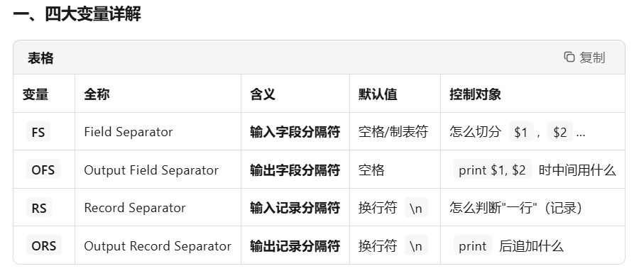

```bash
[root@Elson dirs]# awk -F',' '{print $3}' performance_result.csv
label
Login
CreateOrder
Payment
UpdateProfile
Search
AddToCart
Checkout
GetOrders
CancelOrder
Login
[root@Elson dirs]# awk -F',' 'BEGIN{FS="[,\t]"}{print $3}' performance_result.csv
label
Login
CreateOrder
Payment
UpdateProfile
Search
AddToCart
Checkout
GetOrders
CancelOrder
Login
# 使用正则来控制FS按列分割
```

```bash
[root@Elson dirs]# awk -F',' 'BEGIN{FS="[,\t]";OFS="\t"}{print $3,$4}' performance_result.csv | head -n 3
label   responseCode
Login   200
CreateOrder     500
# 使用OFS来控制每一列之间的输出格式
```

```bash
[root@Elson dirs]# awk 'BEGIN{RS=","}{print $0}' performance_result.csv  | head -n10
timestamp
elapsed
label
responseCode
responseMessage
threadName
success
bytes
Latency
1708580400000
# 使用RS=","来进行分行。外层是'',内层是""
```

```bash
[root@Elson dirs]# awk 'BEGIN{RS=",";ORS=","}{print $0}' performance_result.csv  | head -n5
timestamp,elapsed,label,responseCode,responseMessage,threadName,success,bytes,Latency
1708580400000,125,Login,200,OK,Thread-1,true,2048,120
1708580400100,3005,CreateOrder,500,Internal Server Error,Thread-2,false,512,3000
1708580400200,89,Payment,200,OK,Thread-3,true,1024,85
1708580400300,45,UpdateProfile,500,Null Pointer,Thread-1,false,256,40
# ORS="," 使得一列又拼接起来
```

- ###### task01

提取所有 `TestCase#` 后面的用例 ID（如 TC001_UserLogin），要求只显示用例名，不显示 `TestCase#` 前缀

```bash
[root@Elson dirs]# awk '{print $2}' test_execution.log
Test
TC001_UserLogin
TC002_CreateOrder
TC003_PaymentProcess
TC004_UpdateProfile
TC005_Logout
TC006_SearchProduct
TC007_AddToCart
TC008_Checkout
TC009_GetOrderList
TC010_CancelOrder
Test
# 默认是空格
```

- ###### task02

计算每个线程（ThreadID）分别执行了多少个测试用例（提示：第5列 ThreadID=xx）

```bash
[root@Elson dirs]# awk -F '|' '/ThreadID=/{print $4}' test_execution.log | grep -iPo "=\K\d+" | sort -n | uniq -c
      3 5
      2 6
      2 7
      1 8
      1 9
      1 10
# sort -n是按照数字排序
# uniq -c左边是重复次数，右边是值
```

- ###### task03

找出所有响应时间（Duration: xxxms），并转换成纯数字（去掉 ms），计算总和

```bash
[root@Elson dirs]# grep -ioP "duration=\K\d+" test_execution.log | awk 'BEGIN{sum=0;}{sum+=$1}END{print sum}'
9691

```

- task04

从 `api_test.json` 中提取 `case` 和 `duration` 字段，并生成 CSV 格式报告。

```bash
[root@Elson dirs]# awk -F ',' 'BEGIN{OFS=","}{print $3,$5}' api_test.json
"case":"TC001","duration":125
"case":"TC002","duration":3005
"case":"TC003","duration":89
"case":"TC004","duration":45
"case":"TC005","duration":67
```

#### Linux 易错点

##### 1.-P perl比-E更实用，\s可以匹配多个空格

##### 2.$var_name；$(命令表达式)；$((算数表达式)) 是有结果的；[ $((exp1)) -eq 0 ] 算数判断，[ != ] 字符串判断，[[  $((exp1)) -eq 0 && $((exp2)) -eq 1 ]] 

##### 3. $0 : 表示文件；$1 : 表示第一列；$$ : 表示当前脚本进程ID；$? : 表示上一个命令的退出状态（0:success 1:fail）；$! : 最后一个后台运行的进程号；${#car_name[@]} : 长度；${var_name[@]} : 个数。

​	